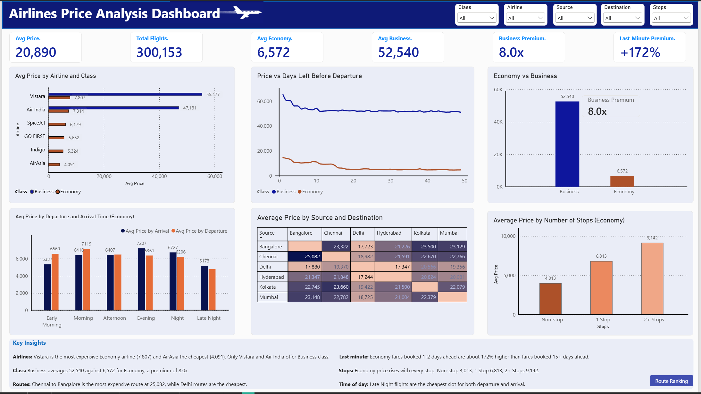
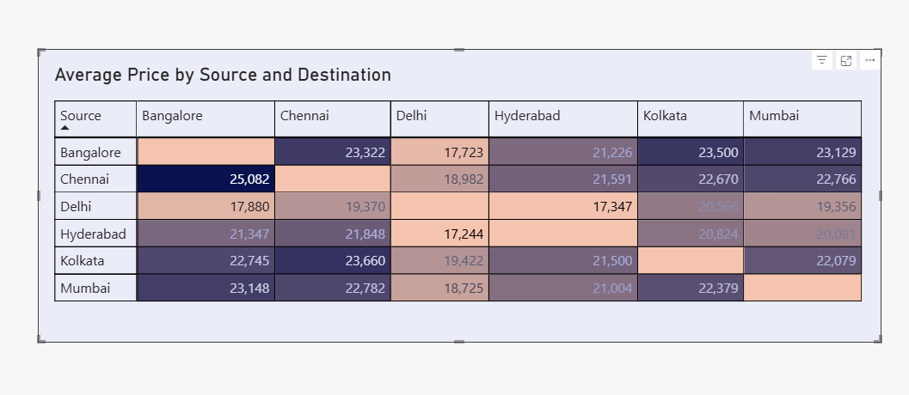

# Airlines Price Analysis Dashboard (Power BI)

An interactive Power BI dashboard analysing flight ticket prices across Indian airlines. The project covers the data cleaning in Power Query, the DAX measures behind each KPI, and a final one-page dashboard with slicers and a Key Insights panel.

## Preview

### Dashboard



### Source and destination matrix

Average price for every source and destination pair, shaded from light (cheaper) to dark (more expensive).



## Business questions

1. How do prices differ across airlines?
2. How does price change for last-minute bookings?
3. What effect do departure and arrival times have on price?
4. How do the source and destination cities affect price?
5. How much more does Business class cost than Economy?

## Dataset

Airlines flight price data, one row per flight listing.

- 300,153 records
- Columns: Airline, Flight, Source City, Departure Time, Stops, Arrival Time, Destination City, Class, Duration (hrs), Days Left, Price


## Data cleaning (Power Query)

1. Promoted headers and set data types.
2. Replaced underscores in text values (for example `Early_Morning` became `Early Morning`).
3. Relabelled stops: `zero` became `Non-stop`, `one` became `1 Stop`, `two_or_more` became `2+ Stops`.
4. Renamed columns to readable names (Source, Destination, Duration (hrs), Days Left, Price).
5. Added helper columns:
   - `Route` (Source - Destination)
   - `Days Left Bucket` (1-2, 3-7, 8-14, 15-30, 31-49 days)
   - Sort columns for the bucket, departure time, arrival time and stops, so charts show categories in a logical order.

A small `Time Slots` table (Early Morning to Late Night) is used so departure and arrival prices can share one axis.

## DAX measures

```
Avg Price = AVERAGE(Flights[Price])

Total Flights = COUNTROWS(Flights)

Avg Economy = CALCULATE(AVERAGE(Flights[Price]), Flights[Class] = "Economy")

Avg Business = CALCULATE(AVERAGE(Flights[Price]), Flights[Class] = "Business")

Business Premium = DIVIDE([Avg Business], [Avg Economy])

Avg Economy Last Minute =
CALCULATE([Avg Economy], Flights[Days Left] <= 2)

Avg Economy Early Booking =
CALCULATE([Avg Economy], Flights[Days Left] >= 15)

Last-Minute Premium % =
DIVIDE([Avg Economy Last Minute], [Avg Economy Early Booking]) - 1

Avg Price by Departure =
CALCULATE(
    AVERAGE(Flights[Price]),
    TREATAS(VALUES('Time Slots'[Slot]), Flights[Departure Time])
)

Avg Price by Arrival =
CALCULATE(
    AVERAGE(Flights[Price]),
    TREATAS(VALUES('Time Slots'[Slot]), Flights[Arrival Time])
)
```

The KPI cards use text versions of these measures built with `FORMAT()`, because the Card visual abbreviates numbers (21K, 300K) otherwise.

## Dashboard contents

**KPI cards:** Avg Price, Total Flights, Avg Economy, Avg Business, Business Premium, Last-Minute Premium.

**Charts:**

- Avg Price by Airline and Class (bar)
- Price vs Days Left Before Departure (line, split by class)
- Economy vs Business (column)
- Avg Price by Departure and Arrival Time, Economy (clustered column)
- Average Price by Source and Destination (matrix with colour scale)
- Average Price by Number of Stops, Economy (column)

**Slicers:** Class, Airline, Source, Destination, Stops.

Class is always shown separately or filtered, because Business fares are about 8 times Economy and only two airlines sell Business. Averaging them together would be misleading.

## Key findings

- Overall average price is 20,890. Economy averages 6,572 and Business averages 52,540, a premium of 8.0x.
- Vistara is the most expensive Economy airline (7,807) and AirAsia the cheapest (4,091). Only Vistara and Air India sell Business class.
- Economy fares booked 1-2 days before departure are about 172% higher than fares booked 15 or more days ahead.
- Economy price rises with every stop: Non-stop 4,013, 1 Stop 6,813, 2+ Stops 9,142.
- Chennai to Bangalore is the most expensive route (25,082). Routes involving Delhi are the cheapest.
- Late Night flights are the cheapest slot for both departure and arrival.

## How to open

The `.pbix` file needs Power BI Desktop (Windows). The screenshot above shows the finished dashboard if you do not have it.

## Tools

Power BI Desktop, Power Query (M), DAX.


